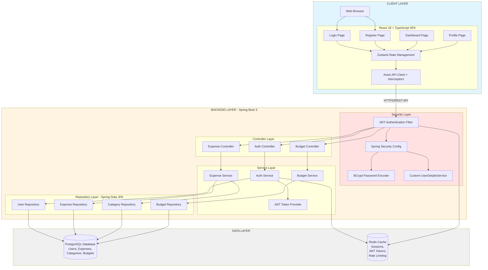
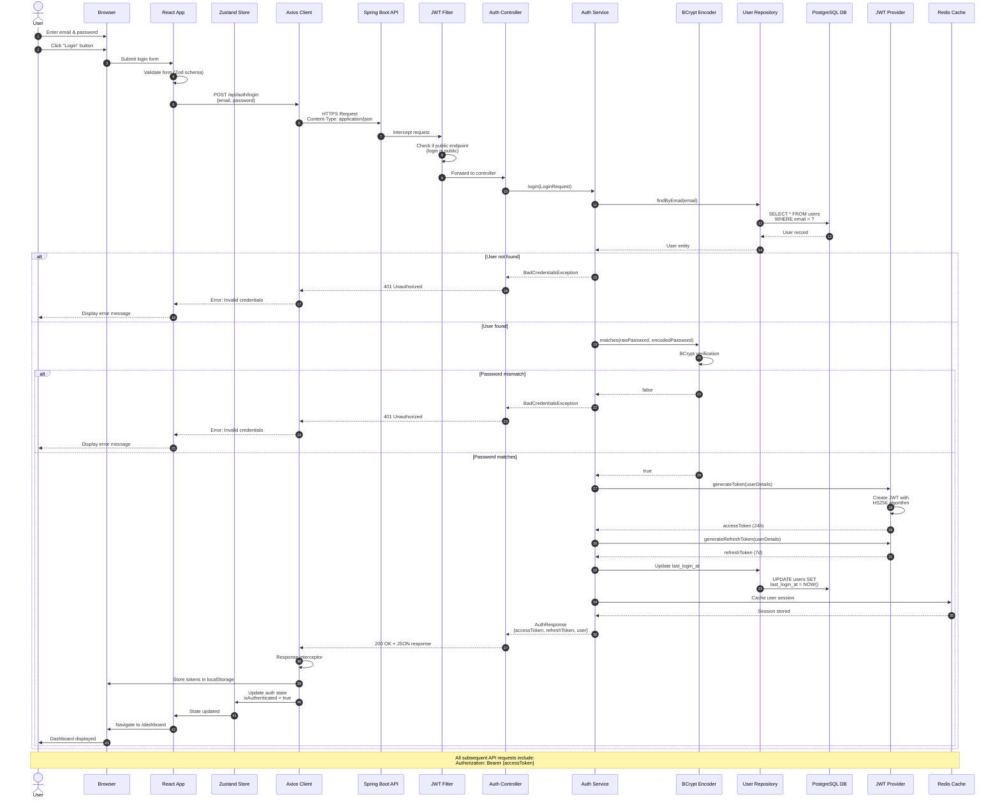
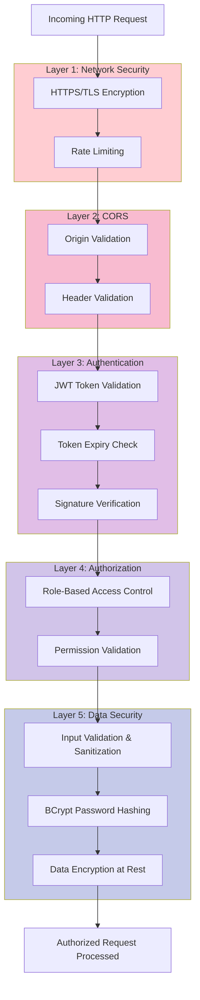
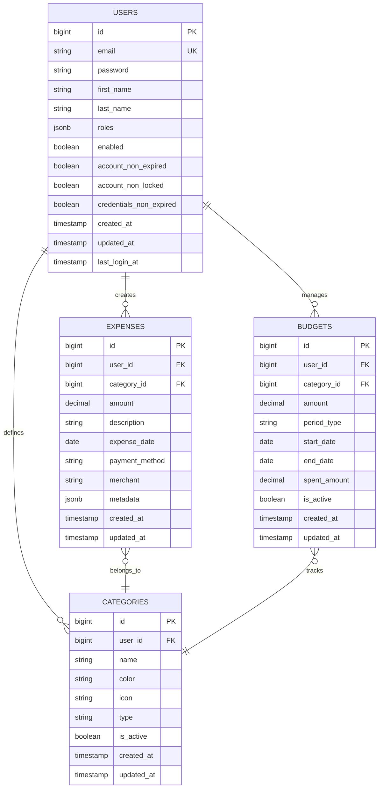
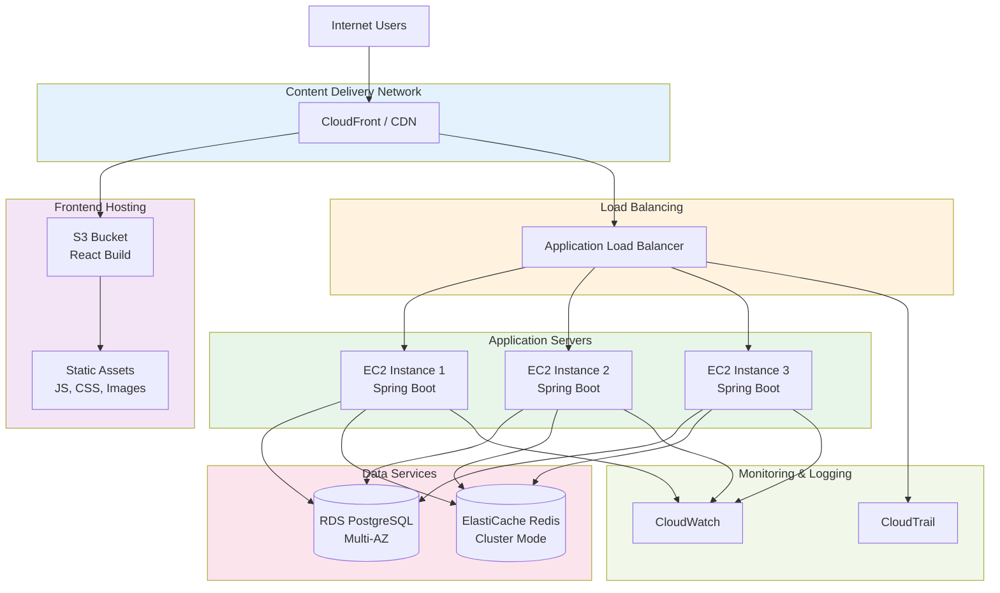

# Expense Tracker - System Architecture Diagram

## Visual System Architecture



## User Login Request Flow - Detailed Sequence Diagram



## Component Interaction - Data Flow Architecture

```mermaid
flowchart LR
    subgraph Frontend
        UI[User Interface]
        Store[Zustand Store]
        API[API Client]
    end

    subgraph SecurityLayer["Security & Auth"]
        CORS[CORS Filter]
        JWT[JWT Filter]
        Auth[Authentication Manager]
    end

    subgraph BusinessLayer["Business Logic"]
        Controllers[Controllers]
        Services[Services]
        Validation[Data Validation]
    end

    subgraph DataAccess["Data Access"]
        Repos[Repositories]
        Cache[Redis Cache]
        DB[PostgreSQL]
    end

    UI -->|User Action| Store
    Store -->|API Call| API
    API -->|HTTPS Request<br/>+ JWT Token| CORS
    
    CORS -->|Validate Origin| JWT
    JWT -->|Extract & Validate Token| Auth
    Auth -->|Authenticated Request| Controllers
    
    Controllers -->|Business Logic| Services
    Services -->|Validate Data| Validation
    Validation -->|Query/Persist| Repos
    
    Repos -->|Check Cache| Cache
    Cache -->|Cache Miss| DB
    DB -->|Data| Repos
    Repos -->|Update Cache| Cache
    
    Repos -->|Response| Services
    Services -->|DTO| Controllers
    Controllers -->|JSON Response| API
    API -->|Update State| Store
    Store -->|Re-render| UI

    style Frontend fill:#e3f2fd
    style SecurityLayer fill:#ffebee
    style BusinessLayer fill:#f3e5f5
    style DataAccess fill:#e8f5e9
```



## Security Architecture - Multi-Layer Defense



## Database Schema Architecture



## Deployment Architecture (Production)



## Technology Stack Overview

| Layer | Technology | Version | Purpose |
|-------|-----------|---------|---------|
| **Frontend** | React | 18.x | Modern UI framework with hooks |
| | TypeScript | 5.x | Type-safe development |
| | Vite | 5.x | Fast build tool and dev server |
| | Zustand | 4.x | Lightweight state management |
| | Axios | 1.x | HTTP client with interceptors |
| | React Router | 6.x | Client-side routing |
| | Tailwind CSS | 3.x | Utility-first CSS framework |
| **Backend** | Spring Boot | 3.2.x | Enterprise Java framework |
| | Java | 21 | LTS version with virtual threads |
| | Spring Security | 6.x | Authentication & authorization |
| | Spring Data JPA | 3.x | Data access layer |
| | JWT (JJWT) | 0.12.x | JSON Web Token implementation |
| | Maven | 3.9.x | Build and dependency management |
| **Database** | PostgreSQL | 15+ | Relational database with JSONB |
| | Redis | 7.x | In-memory cache and session store |
| **Security** | BCrypt | - | Password hashing algorithm |
| | HTTPS/TLS | 1.3 | Transport layer security |
| | CORS | - | Cross-origin resource sharing |
| **DevOps** | Docker | 24.x | Containerization |
| | Docker Compose | 2.x | Multi-container orchestration |
| | GitHub Actions | - | CI/CD pipeline |
| **Deployment** | Railway/AWS | - | Cloud hosting platform |

## Key Architectural Decisions

### 1. **JWT-Based Stateless Authentication**
- **Decision**: Use JWT tokens instead of session-based authentication
- **Rationale**: 
  - Scalability: No server-side session storage needed
  - Microservices ready: Tokens can be validated independently
  - Mobile-friendly: Easy to implement in mobile apps
- **Implementation**: 
  - Access tokens: 24-hour expiry
  - Refresh tokens: 7-day expiry
  - Redis cache for token blacklisting (logout)

### 2. **React + TypeScript for Frontend**
- **Decision**: Use React with TypeScript instead of JavaScript
- **Rationale**:
  - Type safety reduces runtime errors
  - Better IDE support and autocomplete
  - Easier refactoring and maintenance
  - Industry standard for modern web apps

### 3. **Spring Boot 3 with Java 21**
- **Decision**: Use latest Spring Boot with Java 21
- **Rationale**:
  - Virtual threads for better performance
  - Enhanced security features
  - Modern Java features (records, pattern matching)
  - Active community and long-term support

### 4. **PostgreSQL + Redis Architecture**
- **Decision**: Use PostgreSQL for persistent data and Redis for caching
- **Rationale**:
  - PostgreSQL: ACID compliance, JSONB support, complex queries
  - Redis: Fast session management, rate limiting, caching
  - Best of both worlds: Reliability + Performance

### 5. **Layered Architecture Pattern**
- **Decision**: Separate concerns into Controller → Service → Repository layers
- **Rationale**:
  - Clear separation of concerns
  - Easy to test each layer independently
  - Maintainable and scalable codebase
  - Industry best practice

## Security Features Implemented

✅ **Authentication**
- Email/password registration with validation
- Secure login with JWT token generation
- Password hashing with BCrypt (strength 10)
- Token-based session management

✅ **Authorization**
- Role-based access control (ROLE_USER, ROLE_ADMIN)
- JWT token validation on protected endpoints
- Automatic token refresh mechanism

✅ **Data Protection**
- HTTPS/TLS encryption in transit
- Password hashing at rest
- CORS configuration for allowed origins
- Input validation and sanitization

✅ **Session Management**
- Stateless JWT tokens
- Redis-based session storage
- Secure logout with context clearing
- Token expiration handling

✅ **Error Handling**
- Global exception handler
- Secure error messages (no sensitive data exposure)
- Proper HTTP status codes
- User-friendly error responses

## API Endpoints

### Authentication Endpoints

| Method | Endpoint | Description | Auth Required |
|--------|----------|-------------|---------------|
| POST | `/api/auth/register` | Register new user | No |
| POST | `/api/auth/login` | Authenticate user | No |
| POST | `/api/auth/logout` | Logout user | Yes |
| GET | `/api/auth/me` | Get current user | Yes |

### Request/Response Examples

#### Login Request
```json
POST /api/auth/login
Content-Type: application/json

{
  "email": "user@example.com",
  "password": "SecurePassword123!"
}
```

#### Login Response
```json
HTTP/1.1 200 OK
Content-Type: application/json

{
  "success": true,
  "message": "Login successful",
  "data": {
    "accessToken": "eyJhbGciOiJIUzI1NiIsInR5cCI6IkpXVCJ9...",
    "refreshToken": "eyJhbGciOiJIUzI1NiIsInR5cCI6IkpXVCJ9...",
    "tokenType": "Bearer",
    "expiresIn": 86400000,
    "user": {
      "id": 1,
      "email": "user@example.com",
      "firstName": "John",
      "lastName": "Doe",
      "roles": ["ROLE_USER"],
      "createdAt": "2025-11-01T10:00:00",
      "lastLoginAt": "2025-11-02T08:30:00"
    }
  },
  "timestamp": 1730537400000
}
```

## Performance Considerations

- **Caching Strategy**: Redis caching for frequently accessed data
- **Connection Pooling**: HikariCP for efficient database connections
- **Lazy Loading**: JPA lazy loading for related entities
- **Index Optimization**: Database indexes on frequently queried columns
- **Stateless Design**: Horizontal scaling without session affinity
- **CDN Usage**: Static assets served from CDN for faster load times

## Future Enhancements

1. **OAuth2 Integration**: Google, Facebook, GitHub login
2. **Two-Factor Authentication (2FA)**: Enhanced security with TOTP
3. **Rate Limiting**: API rate limiting per user/IP
4. **Audit Logging**: Track all user actions for compliance
5. **Email Verification**: Verify user email on registration
6. **Password Reset**: Secure password reset flow
7. **Websocket Support**: Real-time notifications
8. **Mobile App**: React Native mobile application

