# Expense Tracker - System Architecture Diagram

## Simple System Overview

## User Login Flow (Simplified)

```mermaid
sequenceDiagram
    participant User
    participant Frontend as React App
    participant Backend as Spring Boot
    participant DB as Database

    User->>Frontend: 1. Enter email & password
    Frontend->>Backend: 2. POST /api/auth/login
    Backend->>DB: 3. Verify credentials
    DB-->>Backend: 4. User found ✓
    Backend->>Backend: 5. Generate JWT token
    Backend-->>Frontend: 6. Return token + user data
    Frontend->>Frontend: 7. Store token
    Frontend-->>User: 8. Redirect to Dashboard ✓

    Note over User,DB: Future requests include JWT token in header
```

## Security Architecture - Multi-Layer Defense

## Database Schema Architecture

## Technology Stack Overview

| Layer | Technology | Purpose |
|-------|-----------|---------|
| **Frontend** | React 18 + TypeScript | Modern UI with type safety |
| | Vite | Fast build tool |
| | Zustand | State management |
| | Axios | HTTP client |
| **Backend** | Spring Boot 3 + Java 21 | Enterprise framework |
| | Spring Security | Authentication & authorization |
| | JWT (JJWT) | Token-based auth |
| **Database** | PostgreSQL 15+ | Relational database |
| | Redis 7.x | Cache & session store |
| **Security** | BCrypt | Password hashing |
| | HTTPS/TLS | Transport security |

---

## Key Features

### Authentication System
✅ User registration with email/password  
✅ Secure login with JWT tokens  
✅ BCrypt password hashing (strength 10)  
✅ Stateless session management  
✅ Protected routes with automatic redirect  

### Security Features
✅ Multi-layer security architecture  
✅ CORS configuration  
✅ JWT token validation  
✅ Role-based access control  
✅ Input validation & sanitization  

### API Endpoints
- `POST /api/auth/register` - Create account
- `POST /api/auth/login` - Authenticate user
- `POST /api/auth/logout` - Terminate session
- `GET /api/auth/me` - Get current user

---

**Document Version**: 1.0 (Simplified)  
**Last Updated**: November 2, 2025

